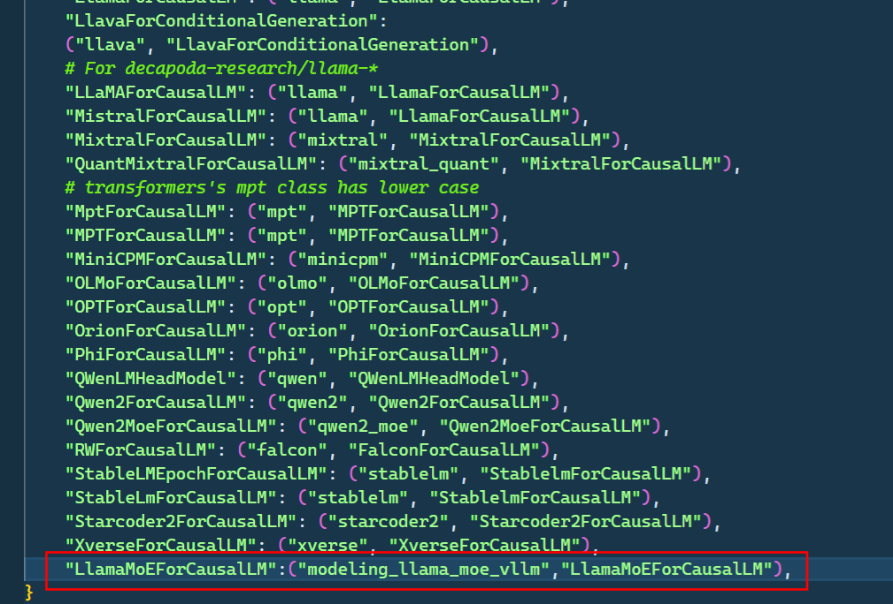

# 1. 对vllm的支持
    1. 定义模型文件modeling_llama_moe_vllm.py
    2. 添加对vllm的支持
        （1）方式一：   https://docs.vllm.ai/en/stable/models/adding_model.html
            采用官方文档直接注册的方式，发现可能不起作用
        （2）方式二：
            在方式一不起作用的情况下，修改vllm库的代码，具体步骤如下：
                ① 在环境中vllm目录下：env/vllm/lib64/python3.8/site-packages/vllm/model_executor/model 添加模型文件modeling_llama_moe_vllm.py
                ② 在文件/env/vllm/lib64/python3.8/site-packages/vllm/model_executor/models/__init__.py 中注册模型

     
    
     

